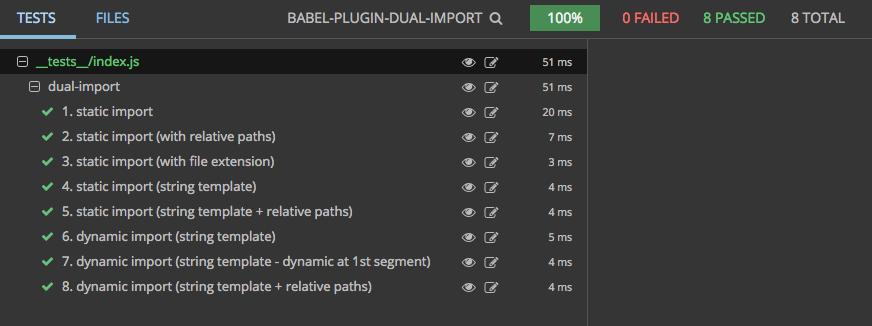

# babel-plugin-dual-import [](https://gitter.im/Reactlandia/Lobby)

<p align="center">
  <a href="https://www.npmjs.com/package/babel-plugin-dual-import">
    
  </a>

  <a href="https://travis-ci.org/faceyspacey/babel-plugin-dual-import">
    
  </a>

  <a href="https://lima.codeclimate.com/github/faceyspacey/babel-plugin-dual-import/coverage">
    
  </a>

  <a href="https://greenkeeper.io">
    
  </a>

  <a href="https://lima.codeclimate.com/github/faceyspacey/babel-plugin-dual-import">
    
  </a>

  <a href="https://www.npmjs.com/package/babel-plugin-dual-import">
    
  </a>

  <a href="https://www.npmjs.com/package/babel-plugin-dual-import">
    
  </a>
</p>


To learn about what this does, read its introduction article:
https://medium.com/@faceyspacey/webpacks-import-will-soon-fetch-js-css-here-s-how-you-do-it-today-4eb5b4929852


## Installation
```
yarn add babel-plugin-dual-import
```
*.babelrc:*
```js
{
  "presets": [whatever you usually have],
  "plugins": ["dual-import"]
}
```


## What it does
Taking from the [test snapshots](./__tests__/__snapshots__/index.js.snap), it does this:

```js
import('./Foo.js')

      ↓ ↓ ↓ ↓ ↓ ↓

import importCss from 'babel-plugin-dual-import/importCss.js'

Promise.all([
  import( /* webpackChunkName: 'Foo' */ './Foo'),
  importCss('Foo')
]).then(promises => promises[0]);

```

And if you're using dynamic imports:

```js
import(`../base/${page}`)

      ↓ ↓ ↓ ↓ ↓ ↓

import importCss from 'babel-plugin-dual-import/importCss.js'

Promise.all([
  import( /* webpackChunkName: 'base/[request]' */ `./base/${page}`),
  importCss(`base/${page}`)
]).then(promises => promises[0]);
```

It names all your chunks using *"magic comments"* 🔮 behind the scenes and is derived from the imported file. It's *so magic* you don't gotta use "magic comments" anymore. This works with both static and dynamic import paths, as you can see above.


## How do I Serve the Css:

**Use [webpack-flush-chunks](https://github.com/faceyspacey/webpack-flush-chunks) to serve a hash of chunk names to css files. It's built to work with this.** `importCss(chunkName)` will retreive it from there.

If you don't wanna do that, you can dig through your webpack stats and manually embed the following in the HTML you serve:

```html
<script>
  window.__CSS_CHUNKS__ = {
    Foo: '/static/Foo.css',
    'base/Page1': '/static/base/Page1.css',
    'base/Page2': '/static/base/Page2.css',
  }
</script>
```

## Usage with [react-universal-component](https://github.com/faceyspacey/react-universal-component) and [webpack-flush-chunks](https://github.com/faceyspacey/webpack-flush-chunks)

When using `webpack-flush-chunks` you will have to supply the `chunkNames` option, not the `moduleIds` option since this plugin is based on chunk names. Here's an example:

*src/components/App.js:*
```js
const UniversalComponent = universal(() => import('./Foo'), {
  resolve: () => require.resolveWeak('./Foo'),
  chunkName: 'Foo'
})

const UniversalDynamicComponent = universal(() => import(`./base/${page}`), {
  resolve: ({ page }) => require.resolveWeak(`./base/${page}`),
  chunkName: ({ page }) => `base/${page}`
})

```
*server/render.js:*
```js
import { flushChunkNames } from 'react-universal-component/server'
import flushChunks from 'webpack-flush-chunks'

const app = ReactDOMServer.renderToString(<App />)
const { js, styles, cssHash } = flushChunks(webpackStats, {
  chunkNames: flushChunkNames()
})

res.send(`
  <!doctype html>
  <html>
    <head>
      ${styles}
    </head>
    <body>
      <div id="root">${app}</div>
      ${js}
      ${cssHash}
    </body>
  </html>
`)
```

## Babel Server Or Webpack < 2.2.20

If your compiling the server with Babel, you may need to add this babel-plugin as well: [babel-plugin-dynamic-import-webpack](https://github.com/airbnb/babel-plugin-dynamic-import-webpack). And if you're using a version of Webpack before 2.2.0, you also must add it.


## Caveat

The chunk name is created out of the path you provide *(stripping slashes, dots and extension)*. So if in one dir you have `./Page` and in another place you have `../components/Page`, well then you gotta do the same for the first one even if you're already in the same directory. I.e. `components` gotta be the first named path segment in both cases.


## Contributing

We use [commitizen](https://github.com/commitizen/cz-cli), so run `npm run cm` to make commits. A command-line form will appear, requiring you answer a few questions to automatically produce a nicely formatted commit. Releases, semantic version numbers, tags, changelogs and publishing to NPM will automatically be handled based on these commits thanks to [semantic-release](https://github.com/semantic-release/semantic-release). Be good.


## Tests

Reviewing a package's tests are a great way to get familiar with it. It's direct insight into the capabilities of the given package (if the tests are thorough). What's even better is a screenshot of the tests neatly organized and grouped (you know the whole "a picture says a thousand words" thing). 

Below is a screenshot of this module's tests running in [Wallaby](https://wallabyjs.com) *("An Integrated Continuous Testing Tool for JavaScript")* which everyone in the React community should be using. It's fantastic and has taken my entire workflow to the next level. It re-runs your tests on every change along with comprehensive logging, bi-directional linking to your IDE, in-line code coverage indicators, **and even snapshot comparisons + updates for Jest!** I requestsed that feature by the way :). It's basically a substitute for live-coding that inspires you to test along your journey.



